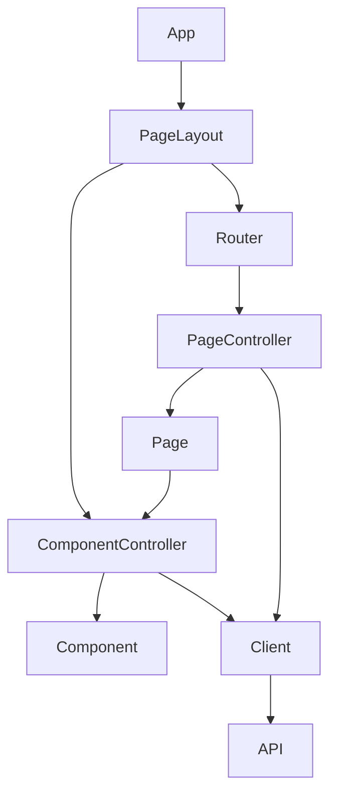

## App
Top level component responsible for holding app wide state and context

## PageLayout
App wide Layout that includes reusable components like Headers and Navigation Menus

## Router
Holds Routes and decides which Page to show with a given URL

## PageController
Holds page level logic and state, fetches data from clients.

## Page
Actual Page layout, uses reusable components to build the UI, all logic is delegated to the Controller

## ComponentController
Holds component level logic. May fetch and push data to a client.

## Component
Component Layout, includes all UI elements, logic is delegated to the controller

## Client
API abstraction. Offers simple functions and handles all logic required to talk to the UI

## API
Server API, not part of the frontend