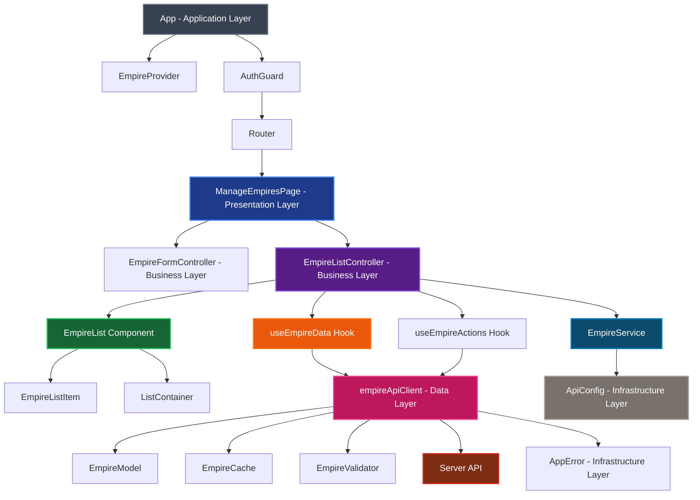

# GRoGG Chronicler - Project Architecture Guide

## Overview

This document outlines the preferred architecture patterns used in the GRoGG Chronicler project. It demonstrates the complete data flow from routing to component rendering using the Empire Management feature as a primary example.


```mermaid
flowchart TD
    App[App - Application Layer] --> EmpireProvider[EmpireProvider]
    App --> AuthGuard[AuthGuard]
    AuthGuard --> Router[Router]
    Router --> ManageEmpiresPage[ManageEmpiresPage - Presentation Layer]
    
    ManageEmpiresPage --> EmpireFormController[EmpireFormController - Business Layer]
    ManageEmpiresPage --> EmpireListController[EmpireListController - Business Layer]
    
    EmpireListController --> useEmpireData[useEmpireData Hook]
    EmpireListController --> useEmpireActions[useEmpireActions Hook]
    EmpireListController --> EmpireService[EmpireService]
    EmpireListController --> EmpireList[EmpireList Component]
    
    EmpireList --> EmpireListItem[EmpireListItem]
    EmpireList --> ListContainer[ListContainer]
    
    useEmpireData --> empireApiClient[empireApiClient - Data Layer]
    useEmpireActions --> empireApiClient
    
    empireApiClient --> EmpireModel[EmpireModel]
    empireApiClient --> EmpireCache[EmpireCache]
    empireApiClient --> EmpireValidator[EmpireValidator]
    empireApiClient --> API[Server API]
    
    EmpireService --> ApiConfig[ApiConfig - Infrastructure Layer]
    empireApiClient --> AppError[AppError - Infrastructure Layer]
    
    style App fill:#374151,stroke:#6b7280,stroke-width:2px,color:#ffffff
    style ManageEmpiresPage fill:#1e3a8a,stroke:#3b82f6,stroke-width:2px,color:#ffffff
    style EmpireListController fill:#581c87,stroke:#8b5cf6,stroke-width:2px,color:#ffffff
    style EmpireList fill:#166534,stroke:#22c55e,stroke-width:2px,color:#ffffff
    style useEmpireData fill:#ea580c,stroke:#f97316,stroke-width:2px,color:#ffffff
    style empireApiClient fill:#be185d,stroke:#ec4899,stroke-width:2px,color:#ffffff
    style API fill:#7c2d12,stroke:#dc2626,stroke-width:2px,color:#ffffff
    style ApiConfig fill:#78716c,stroke:#a8a29e,stroke-width:2px,color:#ffffff
    style EmpireService fill:#0c4a6e,stroke:#0284c7,stroke-width:2px,color:#ffffff
```

## Architectural Principles

### 1. **Enhanced Separation of Concerns**

#### **Application Layer**
- **App.js**: Global application setup, providers, and error boundaries
- **Context Providers**: Global state management (authentication, theme, settings)
- **Routing**: Route definitions, navigation configuration, and routing logic
- **Route Guards**: Authentication and authorization logic

#### **Presentation Layer**
- **Pages**: Route-level components that coordinate page state and layout
- **Layouts**: Reusable page templates (PageLayout, AuthLayout, etc.)
- **Components**: Pure UI components focused only on rendering
- **Forms**: Dedicated form components with validation logic
- **Styles**: CSS files, themes, and visual styling

#### **Business Logic Layer**
- **Controllers**: Orchestrate business operations and coordinate between services
- **Services**: Encapsulate specific domain logic (validation, calculations, transformations)
- **Hooks**: Reusable stateful logic and side effects
- **Utilities**: Pure functions for common operations

#### **Data Access Layer**
- **API Clients**: HTTP communication and request/response handling
- **Cache Management**: Data caching, invalidation, and synchronization
- **Data Models**: Type definitions and data transformation
- **Validators**: Input validation and data sanitization

#### **Infrastructure Layer**
- **Configuration**: Environment variables and app configuration
- **Constants**: Application-wide constants and enums
- **Error Handling**: Centralized error management and logging
- **Types**: Common utility types and cross-cutting type definitions

#### **Example Enhanced Structure**:
```
src/
├── app/                    # Application Layer
│   ├── App.js
│   ├── providers/
│   ├── guards/
│   └── routing/
├── presentation/           # Presentation Layer
│   ├── pages/
│   ├── layouts/
│   ├── components/
│   ├── forms/
│   └── styles/
├── business/              # Business Logic Layer
│   ├── controllers/
│   ├── services/
│   ├── hooks/
│   └── utils/
├── data/                  # Data Access Layer
│   ├── clients/
│   ├── cache/
│   ├── models/
│   ├── validators/
└── infrastructure/        # Infrastructure Layer
    ├── config/
    ├── constants/
    ├── errors/
    └── types/
```

### 2. **Controller Pattern**

- Controllers act as intermediaries between pages and components
- They encapsulate business logic orchestration
- They provide a clean interface for components to interact with data

### 3. **Custom Hooks for Reusability**

- Common patterns are extracted into reusable hooks
- State management logic is centralized
- Consistent error handling across the application

### 4. **Single Responsibility Principle**

#### **Enhanced Separation Example**:
```tsx
// services/EmpireService.ts - Pure business logic
export class EmpireService {
    static validateEmpireData(data: Partial<Empire>): ValidationResult {
        // Pure validation logic
    }
    
    static calculateEmpireStats(empire: Empire): EmpireStats {
        // Pure calculation logic
    }
}

// controllers/EmpireController.tsx - Orchestration only
export default function EmpireController({ onEdit, onDelete }) {
    const empireData = useEmpireData();
    const empireActions = useEmpireActions();
    
    // Only orchestrates, doesn't contain business logic
    return <EmpireList empires={empireData.empires} onEdit={empireActions.edit} />;
}

// hooks/useEmpireData.ts - Data management only
export function useEmpireData() {
    // Only handles data fetching and state
}

// hooks/useEmpireActions.ts - Action coordination only
export function useEmpireActions() {
    // Only handles action dispatching
}
```

#### **Benefits of Enhanced Separation**:
- 🧪 **Testability**: Each layer can be unit tested in isolation
- 🔄 **Reusability**: Services and utilities can be reused across features
- 🛠️ **Maintainability**: Changes to one concern don't affect others
- 🎯 **Single Purpose**: Each file has one clear responsibility
- 🔍 **Debuggability**: Easier to trace issues to specific layers

## Architecture Flow: Enhanced Layer Separation → Empire Management

The following demonstrates how the enhanced 5-layer architecture flows through the Empire Management feature:

### **Application Layer** → **Presentation Layer** → **Business Logic Layer** → **Data Access Layer** → **Infrastructure Layer**

### 1. **Application Layer** (`src/app/`)

```jsx
// App.js - Global setup and providers
import { EmpireProvider } from './providers/EmpireProvider';
import { AuthGuard } from './guards/AuthGuard';

export default function App() {
    return (
        <EmpireProvider>
            <AuthGuard>
                <Router />
            </AuthGuard>
        </EmpireProvider>
    );
}
```

**Purpose**: 
- Global application configuration and setup
- Context providers and authentication guards
- Error boundaries and performance monitoring

---

### 2. **Presentation Layer** (`src/presentation/`)

#### **Page Component** (`src/presentation/pages/ManageEmpiresPage.tsx`)

```tsx
import React from 'react';
import { EmpireManagementLayout } from '../layouts/EmpireManagementLayout';
import { EmpireListController } from '../../business/controllers/EmpireListController';
import { EmpireFormController } from '../../business/controllers/EmpireFormController';

export default function ManageEmpiresPage() {
    return (
        <EmpireManagementLayout>
            <EmpireFormController mode="create" />
            <EmpireListController />
        </EmpireManagementLayout>
    );
}
```

#### **Pure Components** (`src/presentation/components/`)

```tsx
// EmpireList.tsx - Pure presentation component
export default function EmpireList({ empires, onEdit, onDelete, loading }) {
    return (
        <ListContainer loading={loading}>
            {empires.map(empire => (
                <EmpireListItem 
                    key={empire.id}
                    empire={empire}
                    onEdit={() => onEdit(empire)}
                    onDelete={() => onDelete(empire.id)}
                />
            ))}
        </ListContainer>
    );
}
```

**Purpose**:
- Pure UI rendering without business logic
- Page layout and component composition
- User interaction handling (events only)
- Visual state management (loading, modals)

---

### 3. **Business Logic Layer** (`src/business/`)

#### **Controller** (`src/business/controllers/EmpireListController.tsx`)

```tsx
import { useEmpireData } from '../hooks/useEmpireData';
import { useEmpireActions } from '../hooks/useEmpireActions';
import { EmpireService } from '../services/EmpireService';

export default function EmpireListController() {
    const { empires, loading, error } = useEmpireData();
    const { editEmpire, deleteEmpire } = useEmpireActions();

    const handleEdit = (empire: Empire) => {
        if (EmpireService.canEdit(empire)) {
            editEmpire(empire);
        }
    };

    return (
        <EmpireList 
            empires={empires}
            onEdit={handleEdit}
            onDelete={deleteEmpire}
            loading={loading}
        />
    );
}
```

#### **Service** (`src/business/services/EmpireService.ts`)

```tsx
export class EmpireService {
    static validateEmpireData(data: Partial<Empire>): ValidationResult {
        return EmpireValidator.validate(data);
    }
    
    static canEdit(empire: Empire): boolean {
        return empire.status !== 'locked' && empire.account !== null;
    }
    
    static formatDisplayName(empire: Empire): string {
        return `${empire.name} (${empire.account || 'Unassigned'})`;
    }
}
```

#### **Specialized Hooks** (`src/business/hooks/`)

```tsx
// hooks/useEmpireData.ts - Data fetching only
export function useEmpireData() {
    const { data, loading, error, fetchEntities } = useCRUD<Empire>({
        apiClient: empireApiClient
    });
    
    return { empires: data, loading, error, refetch: fetchEntities };
}

// hooks/useEmpireActions.ts - Action coordination only
export function useEmpireActions() {
    const { updateEntity, deleteEntity } = useCRUD<Empire>({
        apiClient: empireApiClient
    });
    
    return {
        editEmpire: updateEntity,
        deleteEmpire: deleteEntity
    };
}
```

**Purpose**:
- Orchestrates business operations
- Contains domain-specific logic and rules
- Coordinates between data and presentation layers
- Handles complex workflows and validations

---

### 4. **Data Access Layer** (`src/data/`)

#### **API Client** (`src/data/clients/empire.client.ts`)

```tsx
import { EmpireModel } from '../models/Empire.model';
import { EmpireCache } from '../cache/empire.cache';

export const empireApiClient = {
    read: async (): Promise<Empire[]> => {
        const cached = EmpireCache.get();
        if (cached && !EmpireCache.isExpired()) {
            return cached;
        }
        
        const response = await fetch('/api/empires');
        const data = await response.json();
        const empires = data.empires.map(EmpireModel.fromAPI);
        
        EmpireCache.set(empires);
        return empires;
    },
    
    create: async (data: Partial<Empire>): Promise<Empire> => {
        const validatedData = EmpireValidator.sanitize(data);
        const response = await fetch('/api/empires', {
            method: 'POST',
            body: JSON.stringify(validatedData)
        });
        
        EmpireCache.invalidate();
        return EmpireModel.fromAPI(await response.json());
    }
};
```

#### **Data Models** (`src/data/models/Empire.model.ts`)

```tsx
export class EmpireModel {
    static fromAPI(apiData: any): Empire {
        return {
            id: apiData.id,
            name: apiData.name,
            account: apiData.account || null,
            createdAt: new Date(apiData.created_at)
        };
    }
    
    static toAPI(empire: Empire): any {
        return {
            id: empire.id,
            name: empire.name,
            account: empire.account,
            created_at: empire.createdAt.toISOString()
        };
    }
}
```

**Purpose**:
- Handles all external data communication
- Manages caching and data synchronization
- Transforms data between API and application formats
- Validates and sanitizes incoming/outgoing data

---

### 5. **Infrastructure Layer** (`src/infrastructure/`)

#### **Configuration** (`src/infrastructure/config/api.config.ts`)

```tsx
export const ApiConfig = {
    baseURL: process.env.REACT_APP_API_URL || '/api',
    timeout: parseInt(process.env.REACT_APP_API_TIMEOUT || '5000'),
    retryAttempts: 3
};
```

#### **Error Handling** (`src/infrastructure/errors/AppError.ts`)

```tsx
export class AppError extends Error {
    constructor(
        message: string,
        public code: string,
        public statusCode: number = 500
    ) {
        super(message);
        this.name = 'AppError';
    }
}
```

**Purpose**:
- Provides configuration and constants
- Handles cross-cutting concerns (logging, errors)
- Common utility types and type definitions
- Framework-agnostic helper functions

---

## Preferred Patterns Summary

### ✅ **DO** - Follow These Patterns

1. **Controller Pattern**: Use controller components to separate business logic from UI
2. **Custom Hooks**: Extract common patterns into reusable hooks (`useCRUD`, `useEntityState`)
3. **API Client Functions**: Use function-based API clients with caching
4. **Component Composition**: Build complex UIs from smaller, reusable components
5. **Event Delegation**: Pass event handlers down from pages through controllers to components
6. **TypeScript Interfaces**: Define clear contracts between layers
7. **Cache Invalidation**: Invalidate caches after mutations for data consistency

### ❌ **DON'T** - Avoid These Anti-patterns

1. **Business Logic in Components**: Keep components focused on UI rendering
2. **Direct API Calls in Components**: Always go through controllers or hooks
3. **Duplicate State Management**: Use custom hooks instead of repeating useState patterns
4. **Tightly Coupled Components**: Components should be reusable and loosely coupled
5. **Missing Error Handling**: Always handle loading, error, and success states
6. **Inconsistent Patterns**: Follow established patterns across similar features

---

## Comprehensive Migration Guide: Current State → Enhanced 5-Layer Architecture

This guide provides **step-by-step instructions** for migrating **every current file** to the enhanced 5-layer architecture. Each phase includes specific file moves, refactoring steps, and code examples.

### **Current Project Structure Analysis**

```
src/
├── App.js                     → app/App.js
├── index.js                   → STAYS AT ROOT (entry point)  
├── PageLayout.jsx             → presentation/layouts/PageLayout.jsx
├── Router.jsx                 → app/routing/Router.jsx
├── clients/                   → data/clients/
├── components/                → presentation/components/ + business/controllers/
├── context/                   → app/providers/
├── controllers/               → business/controllers/
├── css/                       → presentation/styles/
├── handlers/                  → business/services/
├── hooks/                     → business/hooks/ + data/hooks/
├── model/                     → data/models/
├── pages/                     → presentation/pages/
├── types/                     → Split across layers
└── utils/                     → business/utils/
```

---

## **Phase 1: Infrastructure Foundation (Low Risk)**

### **Step 1.1: Create Infrastructure Layer Structure**

**🎯 Goal**: Establish infrastructure foundation and move configuration files.

```bash
# Create infrastructure directories
mkdir -p src/infrastructure/{config,constants,errors,types}
```

#### **File Migrations:**

**1.1.1 Move CSS Files to Presentation Layer**
```bash
# Create presentation styles directory
mkdir -p src/presentation/styles

# Move all CSS files to presentation/styles (NOT infrastructure)
mv src/css/* src/presentation/styles/
```

**Updated Imports in index.js:**
```javascript
// OLD
import './css/App.css';
import './css/Empires.css';
import './css/Accounts.css';
import './css/Boards.css';
import './css/colorbase.css';
import './css/Treaties.css';

// NEW
import './presentation/styles/App.css';
import './presentation/styles/Empires.css';
import './presentation/styles/Accounts.css';
import './presentation/styles/Boards.css';
import './presentation/styles/colorbase.css';
import './presentation/styles/Treaties.css';
```

**1.1.2 Create Configuration Files**

**Create `src/infrastructure/config/api.config.ts`:**
```typescript
export const ApiConfig = {
    baseURL: process.env.REACT_APP_API_URL || '/api',
    timeout: parseInt(process.env.REACT_APP_API_TIMEOUT || '5000'),
    retryAttempts: 3,
    headers: {
        'Content-Type': 'application/json'
    }
};

export const CacheConfig = {
    ttl: 300000, // 5 minutes
    maxSize: 100
};
```

**Create `src/infrastructure/constants/app.constants.ts`:**
```typescript
export const APP_CONSTANTS = {
    POLLING_INTERVAL: 30000,
    MAX_MESSAGE_LENGTH: 1000,
    DEBOUNCE_DELAY: 300
};

export const ENTITY_LIMITS = {
    MAX_EMPIRES: 50,
    MAX_TREATIES: 100,
    MAX_ACCOUNTS: 20
};
```

**Create `src/infrastructure/errors/AppError.ts`:**
```typescript
export enum ErrorCode {
    NETWORK_ERROR = 'NETWORK_ERROR',
    VALIDATION_ERROR = 'VALIDATION_ERROR',
    AUTH_ERROR = 'AUTH_ERROR',
    NOT_FOUND = 'NOT_FOUND'
}

export class AppError extends Error {
    constructor(
        message: string,
        public code: ErrorCode,
        public statusCode: number = 500,
        public details?: any
    ) {
        super(message);
        this.name = 'AppError';
    }
}

export const ErrorHandler = {
    handle: (error: unknown): AppError => {
        if (error instanceof AppError) return error;
        if (error instanceof Error) {
            return new AppError(error.message, ErrorCode.NETWORK_ERROR);
        }
        return new AppError('Unknown error', ErrorCode.NETWORK_ERROR);
    }
};
```

**Create `src/infrastructure/types/common.types.ts`:**
```typescript
export interface LoadingState {
    loading: boolean;
    error: string;
    success: string;
}

export interface EntityState<T> {
    data: T[];
    loading: boolean;
    error: string;
    lastFetch: Date | null;
}

export interface PaginationState {
    page: number;
    limit: number;
    total: number;
    hasMore: boolean;
}
```

### **Step 1.2: Move Root Files to Application Layer**

```bash
# Create application layer
mkdir -p src/app/{providers,guards,routing}

# Move root application files
mv src/App.js src/app/
# mv src/index.js src/app/  # KEEP index.js at root - it's the entry point
mv src/Router.jsx src/app/routing/
```

**Update `src/app/App.js`:**
```javascript
import React from 'react';
import PageLayout from '../presentation/layouts/PageLayout';
import Router from './routing/Router';
import { AccountProvider } from './providers/AccountProvider';
import '../presentation/styles/App.css';

export default function App() {
    return (
        <AccountProvider>
            <PageLayout>
                <Router />
            </PageLayout>
        </AccountProvider>
    );
}
```

**Update `src/index.js` (stays at root but imports from new App location):**
```javascript
import React from 'react';
import './presentation/styles/App.css';
import './presentation/styles/Empires.css';
import './presentation/styles/Accounts.css';
import './presentation/styles/Boards.css';
import './presentation/styles/colorbase.css';
import './presentation/styles/Treaties.css';
import ReactDOM from 'react-dom/client';
import App from './app/App'; // Updated import path
import { BrowserRouter, Routes, Route } from 'react-router'
import AccountPage from './presentation/pages/AccountPage';

const root = ReactDOM.createRoot(document.getElementById('root'));
root.render(
    <React.StrictMode>
        <BrowserRouter>
            <Routes>
                <Route path="*" element={<App />} />
            </Routes>
        </BrowserRouter>
    </React.StrictMode>
);
```

---

## **Phase 2: Data Access Layer Setup (Medium Risk)**

### **Step 2.1: Move and Restructure Data Layer**

```bash
# Create data layer structure
mkdir -p src/data/{models,clients,cache,validators,types}

# Move existing files
mv src/model/* src/data/models/
mv src/clients/* src/data/clients/
```

### **Step 2.2: Enhance Model Files**

**Update `src/data/models/Empire.model.ts`:**
```typescript
import { AppError, ErrorCode } from '../../infrastructure/errors/AppError';

export interface Empire {
    id: number | string;
    name: string;
    account?: string;
    lore?: string;
    stats?: string;
    ethics?: string;
    civics?: string;
    special?: string;
    createdAt?: Date;
    updatedAt?: Date;
}

export class EmpireModel {
    static fromAPI(apiData: any): Empire {
        try {
            return {
                id: apiData.id,
                name: apiData.name,
                account: apiData.account || undefined,
                lore: apiData.lore,
                stats: apiData.stats,
                ethics: apiData.ethics,
                civics: apiData.civics,
                special: apiData.special,
                createdAt: apiData.created_at ? new Date(apiData.created_at) : undefined,
                updatedAt: apiData.updated_at ? new Date(apiData.updated_at) : undefined
            };
        } catch (error) {
            throw new AppError('Failed to parse Empire data', ErrorCode.VALIDATION_ERROR);
        }
    }
    
    static toAPI(empire: Empire): any {
        return {
            id: empire.id,
            name: empire.name,
            account: empire.account,
            lore: empire.lore,
            stats: empire.stats,
            ethics: empire.ethics,
            civics: empire.civics,
            special: empire.special,
            created_at: empire.createdAt?.toISOString(),
            updated_at: empire.updatedAt?.toISOString()
        };
    }
}

export function assertEmpireArray(data: any): Empire[] {
    if (!Array.isArray(data)) {
        throw new AppError('Expected array of empires', ErrorCode.VALIDATION_ERROR);
    }
    return data.map(EmpireModel.fromAPI);
}
```

### **Step 2.3: Create Cache Management**

**Create `src/data/cache/empire.cache.ts`:**
```typescript
import { CacheConfig } from '../../infrastructure/config/api.config';
import { Empire } from '../models/Empire.model';

interface CacheEntry<T> {
    data: T;
    timestamp: Date;
    ttl: number;
}

class EntityCache<T> {
    private cache = new Map<string, CacheEntry<T>>();
    
    set(key: string, data: T, ttl: number = CacheConfig.ttl): void {
        this.cache.set(key, {
            data,
            timestamp: new Date(),
            ttl
        });
    }
    
    get(key: string): T | null {
        const entry = this.cache.get(key);
        if (!entry) return null;
        
        if (this.isExpired(entry)) {
            this.cache.delete(key);
            return null;
        }
        
        return entry.data;
    }
    
    invalidate(key?: string): void {
        if (key) {
            this.cache.delete(key);
        } else {
            this.cache.clear();
        }
    }
    
    private isExpired(entry: CacheEntry<T>): boolean {
        return Date.now() - entry.timestamp.getTime() > entry.ttl;
    }
}

export const EmpireCache = new EntityCache<Empire[]>();
export const EmpireInfoCache = new EntityCache<any>();
```

### **Step 2.4: Create Data Validators**

**Create `src/data/validators/empire.validator.ts`:**
```typescript
import { AppError, ErrorCode } from '../../infrastructure/errors/AppError';
import { Empire } from '../models/Empire.model';

export interface ValidationResult {
    isValid: boolean;
    errors: string[];
}

export class EmpireValidator {
    static validate(data: Partial<Empire>): ValidationResult {
        const errors: string[] = [];
        
        if (!data.name || data.name.trim().length < 2) {
            errors.push('Empire name must be at least 2 characters');
        }
        
        if (data.name && data.name.length > 50) {
            errors.push('Empire name must be less than 50 characters');
        }
        
        return {
            isValid: errors.length === 0,
            errors
        };
    }
    
    static sanitize(data: Partial<Empire>): Partial<Empire> {
        return {
            ...data,
            name: data.name?.trim(),
            account: data.account?.trim() || undefined,
            lore: data.lore?.trim() || undefined
        };
    }
    
    static validateAndThrow(data: Partial<Empire>): void {
        const result = this.validate(data);
        if (!result.isValid) {
            throw new AppError(
                result.errors.join(', '),
                ErrorCode.VALIDATION_ERROR,
                400,
                { errors: result.errors }
            );
        }
    }
}
```

### **Step 2.5: Update Data Clients**

**Update `src/data/clients/empires.ts`:**
```typescript
import { ApiConfig } from '../../infrastructure/config/api.config';
import { AppError, ErrorCode, ErrorHandler } from '../../infrastructure/errors/AppError';
import { Empire, EmpireModel } from '../models/Empire.model';
import { EmpireValidator } from '../validators/empire.validator';
import { EmpireCache } from '../cache/empire.cache';

const handleApiResponse = async (response: Response) => {
    if (!response.ok) {
        const errorData = await response.json().catch(() => ({}));
        throw new AppError(
            errorData.message || `HTTP ${response.status}`,
            ErrorCode.NETWORK_ERROR,
            response.status
        );
    }
    return response.json();
};

export const empireApiClient = {
    async read(): Promise<Empire[]> {
        try {
            // Check cache first
            const cached = EmpireCache.get('all');
            if (cached) return cached;
            
            const response = await fetch(`${ApiConfig.baseURL}/empires`, {
                headers: ApiConfig.headers,
                signal: AbortSignal.timeout(ApiConfig.timeout)
            });
            
            const data = await handleApiResponse(response);
            const empires = data.empires?.map(EmpireModel.fromAPI) || [];
            
            // Cache results
            EmpireCache.set('all', empires);
            return empires;
        } catch (error) {
            throw ErrorHandler.handle(error);
        }
    },

    async create(empireDraft: Partial<Empire>): Promise<Empire> {
        try {
            const sanitizedData = EmpireValidator.sanitize(empireDraft);
            EmpireValidator.validateAndThrow(sanitizedData);
            
            const response = await fetch(`${ApiConfig.baseURL}/empires`, {
                method: 'POST',
                headers: ApiConfig.headers,
                body: JSON.stringify(EmpireModel.toAPI(sanitizedData as Empire)),
                signal: AbortSignal.timeout(ApiConfig.timeout)
            });
            
            const data = await handleApiResponse(response);
            const empire = EmpireModel.fromAPI(data);
            
            // Invalidate cache
            EmpireCache.invalidate();
            return empire;
        } catch (error) {
            throw ErrorHandler.handle(error);
        }
    },

    async update(empire: Empire): Promise<Empire> {
        try {
            EmpireValidator.validateAndThrow(empire);
            
            const response = await fetch(`${ApiConfig.baseURL}/empires/${empire.id}`, {
                method: 'PUT',
                headers: ApiConfig.headers,
                body: JSON.stringify(EmpireModel.toAPI(empire)),
                signal: AbortSignal.timeout(ApiConfig.timeout)
            });
            
            const data = await handleApiResponse(response);
            const updatedEmpire = EmpireModel.fromAPI(data);
            
            EmpireCache.invalidate();
            return updatedEmpire;
        } catch (error) {
            throw ErrorHandler.handle(error);
        }
    },

    async delete(id: string | number): Promise<void> {
        try {
            const response = await fetch(`${ApiConfig.baseURL}/empires/${id}`, {
                method: 'DELETE',
                headers: ApiConfig.headers,
                signal: AbortSignal.timeout(ApiConfig.timeout)
            });
            
            await handleApiResponse(response);
            EmpireCache.invalidate();
        } catch (error) {
            throw ErrorHandler.handle(error);
        }
    }
};
```

---

## **Phase 3: Business Logic Layer Migration (High Risk)**

### **Step 3.1: Create Business Layer Structure**

```bash
# Create business layer
mkdir -p src/business/{controllers,services,hooks,utils}

# Move existing controllers
mv src/controllers/* src/business/controllers/
```

### **Step 3.2: Create Business Services**

**Create `src/business/services/EmpireService.ts`:**
```typescript
import { Empire } from '../../data/models/Empire.model';
import { EmpireValidator, ValidationResult } from '../../data/validators/empire.validator';
import { AppError, ErrorCode } from '../../infrastructure/errors/AppError';

export class EmpireService {
    static validateEmpireData(data: Partial<Empire>): ValidationResult {
        return EmpireValidator.validate(data);
    }
    
    static canEdit(empire: Empire, userAccount?: string): boolean {
        if (!empire || !userAccount) return false;
        return empire.account === userAccount || userAccount === 'GameMaster';
    }
    
    static canDelete(empire: Empire, userAccount?: string): boolean {
        return this.canEdit(empire, userAccount);
    }
    
    static formatDisplayName(empire: Empire): string {
        if (!empire.name) return 'Unnamed Empire';
        return `${empire.name}${empire.account ? ` (${empire.account})` : ' (Unassigned)'}`;
    }
    
    static calculateEmpireStats(empire: Empire): {
        hasLore: boolean;
        hasStats: boolean;
        completeness: number;
    } {
        const fields = ['lore', 'stats', 'ethics', 'civics', 'special'];
        const completedFields = fields.filter(field => empire[field as keyof Empire]);
        
        return {
            hasLore: !!empire.lore,
            hasStats: !!empire.stats,
            completeness: (completedFields.length / fields.length) * 100
        };
    }
    
    static searchEmpires(empires: Empire[], query: string): Empire[] {
        if (!query.trim()) return empires;
        
        const searchTerm = query.toLowerCase();
        return empires.filter(empire =>
            empire.name?.toLowerCase().includes(searchTerm) ||
            empire.account?.toLowerCase().includes(searchTerm) ||
            empire.lore?.toLowerCase().includes(searchTerm)
        );
    }
    
    static sortEmpires(empires: Empire[], sortBy: 'name' | 'account' | 'created', direction: 'asc' | 'desc' = 'asc'): Empire[] {
        return [...empires].sort((a, b) => {
            let aValue: string | Date | undefined;
            let bValue: string | Date | undefined;
            
            switch (sortBy) {
                case 'name':
                    aValue = a.name || '';
                    bValue = b.name || '';
                    break;
                case 'account':
                    aValue = a.account || '';
                    bValue = b.account || '';
                    break;
                case 'created':
                    aValue = a.createdAt;
                    bValue = b.createdAt;
                    break;
                default:
                    return 0;
            }
            
            if (!aValue && !bValue) return 0;
            if (!aValue) return direction === 'asc' ? 1 : -1;
            if (!bValue) return direction === 'asc' ? -1 : 1;
            
            const comparison = aValue < bValue ? -1 : aValue > bValue ? 1 : 0;
            return direction === 'asc' ? comparison : -comparison;
        });
    }
}
```

### **Step 3.3: Migrate and Enhance Hooks**

**Move and split hooks:**
```bash
# Move existing hooks
mv src/hooks/* src/business/hooks/

# All hooks stay in business layer - no need for granular subdirectories
# Hooks will be organized by naming convention instead:
# - useEmpireData.ts (data hooks)
# - useEmpireActions.ts (action hooks)  
# - useFormValidation.ts (UI hooks)
```

**Create `src/business/hooks/useEmpireData.ts`:**
```typescript
import { useState, useEffect, useCallback } from 'react';
import { Empire } from '../../data/models/Empire.model';
import { empireApiClient } from '../../data/clients/empires';
import { AppError } from '../../infrastructure/errors/AppError';

export function useEmpireData() {
    const [empires, setEmpires] = useState<Empire[]>([]);
    const [loading, setLoading] = useState(true);
    const [error, setError] = useState<string>('');
    const [lastFetch, setLastFetch] = useState<Date | null>(null);

    const fetchEmpires = useCallback(async () => {
        try {
            setLoading(true);
            setError('');
            const data = await empireApiClient.read();
            setEmpires(data);
            setLastFetch(new Date());
        } catch (err) {
            const error = err instanceof AppError ? err : new AppError('Failed to fetch empires');
            setError(error.message);
            setEmpires([]);
        } finally {
            setLoading(false);
        }
    }, []);

    const refreshData = useCallback(() => {
        return fetchEmpires();
    }, [fetchEmpires]);

    useEffect(() => {
        fetchEmpires();
    }, [fetchEmpires]);

    return {
        empires,
        loading,
        error,
        lastFetch,
        refetch: refreshData
    };
}
```

**Create `src/business/hooks/useEmpireActions.ts`:**
```typescript
import { useCallback } from 'react';
import { Empire } from '../../data/models/Empire.model';
import { empireApiClient } from '../../data/clients/empires';
import { AppError } from '../../infrastructure/errors/AppError';

export function useEmpireActions(onSuccess?: () => void, onError?: (error: string) => void) {
    const createEmpire = useCallback(async (empireDraft: Partial<Empire>) => {
        try {
            const result = await empireApiClient.create(empireDraft);
            onSuccess?.();
            return result;
        } catch (err) {
            const error = err instanceof AppError ? err.message : 'Failed to create empire';
            onError?.(error);
            throw err;
        }
    }, [onSuccess, onError]);

    const updateEmpire = useCallback(async (empire: Empire) => {
        try {
            const result = await empireApiClient.update(empire);
            onSuccess?.();
            return result;
        } catch (err) {
            const error = err instanceof AppError ? err.message : 'Failed to update empire';
            onError?.(error);
            throw err;
        }
    }, [onSuccess, onError]);

    const deleteEmpire = useCallback(async (id: string | number) => {
        try {
            await empireApiClient.delete(id);
            onSuccess?.();
        } catch (err) {
            const error = err instanceof AppError ? err.message : 'Failed to delete empire';
            onError?.(error);
            throw err;
        }
    }, [onSuccess, onError]);

    return {
        createEmpire,
        updateEmpire,
        deleteEmpire
    };
}
```

### **Step 3.4: Refactor Controllers for Business Layer**

**Update `src/business/controllers/EmpireListController.tsx`:**
```typescript
import React from 'react';
import { useEmpireData } from '../hooks/useEmpireData';
import { useEmpireActions } from '../hooks/useEmpireActions';
import { EmpireService } from '../services/EmpireService';
import EmpireList from '../../presentation/components/empire/EmpireList';
import { Empire } from '../../data/models/Empire.model';

interface EmpireListControllerProps {
    onEdit?: (empire: Empire) => void;
    canEdit?: (empire: Empire) => boolean;
    canDelete?: (empire: Empire) => boolean;
    searchQuery?: string;
    sortBy?: 'name' | 'account' | 'created';
    sortDirection?: 'asc' | 'desc';
}

export default function EmpireListController({
    onEdit,
    canEdit = () => true,
    canDelete = () => true,
    searchQuery = '',
    sortBy = 'name',
    sortDirection = 'asc'
}: EmpireListControllerProps) {
    const { empires, loading, error, refetch } = useEmpireData();
    const { deleteEmpire } = useEmpireActions(refetch);

    const handleEdit = (empire: Empire) => {
        if (canEdit(empire)) {
            onEdit?.(empire);
        }
    };

    const handleDelete = async (empire: Empire) => {
        if (canDelete(empire)) {
            await deleteEmpire(empire.id);
        }
    };

    // Apply business logic transformations
    const processedEmpires = React.useMemo(() => {
        let filtered = empires;
        
        if (searchQuery) {
            filtered = EmpireService.searchEmpires(filtered, searchQuery);
        }
        
        return EmpireService.sortEmpires(filtered, sortBy, sortDirection);
    }, [empires, searchQuery, sortBy, sortDirection]);

    return (
        <EmpireList
            empires={processedEmpires}
            loading={loading}
            error={error}
            onEdit={handleEdit}
            onDelete={handleDelete}
            canEdit={canEdit}
            canDelete={canDelete}
        />
    );
}
```

---

## **Phase 4: Presentation Layer Migration (Medium Risk)**

### **Step 4.1: Create Presentation Layer Structure**

```bash
# Create presentation layer
mkdir -p src/presentation/{pages,layouts,components,forms,styles}

# Move pages
mv src/pages/* src/presentation/pages/

# Move PageLayout
mv src/PageLayout.jsx src/presentation/layouts/

# Move CSS files (if not done in Phase 1)
mv src/css/* src/presentation/styles/
```

### **Step 4.2: Reorganize Components**

**Split components by purpose:**

```bash
# Move common components
mv src/components/common/* src/presentation/components/common/

# Move feature-specific components to presentation
mkdir -p src/presentation/components/{empire,account,treaty,navigation}
mv src/components/empire/EmpireList.tsx src/presentation/components/empire/
mv src/components/account/AccountList.tsx src/presentation/components/account/
mv src/components/treaty/TreatyDialog.js src/presentation/components/treaty/

# Keep controllers in business layer (they've already been moved)
# src/components/*Controller.tsx files remain in src/business/controllers/
```

### **Step 4.3: Create Pure Presentation Components**

**Update `src/presentation/components/empire/EmpireList.tsx`:**
```tsx
import React from 'react';
import { Empire } from '../../../data/models/Empire.model';
import { EmpireService } from '../../../business/services/EmpireService';
import LoadingMessage from '../common/LoadingMessage';
import ErrorMessage from '../common/ErrorMessage';
import EmpireListItem from './EmpireListItem';

interface EmpireListProps {
    empires: Empire[];
    loading: boolean;
    error: string;
    onEdit: (empire: Empire) => void;
    onDelete: (empire: Empire) => void;
    canEdit: (empire: Empire) => boolean;
    canDelete: (empire: Empire) => boolean;
}

export default function EmpireList({
    empires,
    loading,
    error,
    onEdit,
    onDelete,
    canEdit,
    canDelete
}: EmpireListProps) {
    if (loading) return <LoadingMessage message="Loading empires..." />;
    if (error) return <ErrorMessage message={error} />;
    if (empires.length === 0) return <div className="empty-state">No empires found</div>;

    return (
        <div className="empire-list">
            <div className="empire-list-header">
                <h2>Empires ({empires.length})</h2>
            </div>
            <div className="empire-list-content">
                {empires.map(empire => (
                    <EmpireListItem
                        key={empire.id}
                        empire={empire}
                        displayName={EmpireService.formatDisplayName(empire)}
                        stats={EmpireService.calculateEmpireStats(empire)}
                        onEdit={() => onEdit(empire)}
                        onDelete={() => onDelete(empire)}
                        canEdit={canEdit(empire)}
                        canDelete={canDelete(empire)}
                    />
                ))}
            </div>
        </div>
    );
}
```

### **Step 4.4: Create Form Components**

**Create `src/presentation/forms/EmpireCreateForm.tsx`:**
```tsx
import React, { useState } from 'react';
import { Empire } from '../../data/models/Empire.model';
import { EmpireValidator } from '../../data/validators/empire.validator';
import FormField from '../components/common/FormField';
import ActionButton from '../components/common/ActionButton';

interface EmpireCreateFormProps {
    onSubmit: (empireDraft: Partial<Empire>) => Promise<void>;
    onCancel: () => void;
    loading?: boolean;
}

export default function EmpireCreateForm({
    onSubmit,
    onCancel,
    loading = false
}: EmpireCreateFormProps) {
    const [formData, setFormData] = useState<Partial<Empire>>({
        name: '',
        account: ''
    });
    const [validationErrors, setValidationErrors] = useState<string[]>([]);

    const handleSubmit = async (e: React.FormEvent) => {
        e.preventDefault();
        
        const validation = EmpireValidator.validate(formData);
        if (!validation.isValid) {
            setValidationErrors(validation.errors);
            return;
        }
        
        setValidationErrors([]);
        await onSubmit(formData);
    };

    const handleChange = (field: keyof Empire, value: string) => {
        setFormData(prev => ({ ...prev, [field]: value }));
        if (validationErrors.length > 0) {
            const newValidation = EmpireValidator.validate({ ...formData, [field]: value });
            setValidationErrors(newValidation.errors);
        }
    };

    return (
        <form onSubmit={handleSubmit} className="empire-create-form">
            <h3>Create New Empire</h3>
            
            {validationErrors.length > 0 && (
                <div className="validation-errors">
                    {validationErrors.map((error, index) => (
                        <div key={index} className="error-message">{error}</div>
                    ))}
                </div>
            )}
            
            <FormField
                label="Empire Name"
                type="text"
                value={formData.name || ''}
                onChange={(value) => handleChange('name', value)}
                required
                disabled={loading}
            />
            
            <FormField
                label="Account"
                type="text"
                value={formData.account || ''}
                onChange={(value) => handleChange('account', value)}
                disabled={loading}
            />
            
            <div className="form-actions">
                <ActionButton
                    type="submit"
                    variant="primary"
                    loading={loading}
                    disabled={loading}
                >
                    Create Empire
                </ActionButton>
                <ActionButton
                    type="button"
                    variant="secondary"
                    onClick={onCancel}
                    disabled={loading}
                >
                    Cancel
                </ActionButton>
            </div>
        </form>
    );
}
```

### **Step 4.5: Update Pages for New Architecture**

**Update `src/presentation/pages/ManageEmpiresPage.tsx`:**
```tsx
import React, { useState } from 'react';
import { Empire } from '../../data/models/Empire.model';
import EmpireListController from '../../business/controllers/EmpireListController';
import EmpireCreateForm from '../forms/EmpireCreateForm';
import { useEmpireActions } from '../../business/hooks/useEmpireActions';
import { useAccount } from '../../app/providers/AccountProvider';

export default function ManageEmpiresPage() {
    const [showCreateForm, setShowCreateForm] = useState(false);
    const [editingEmpire, setEditingEmpire] = useState<Empire | null>(null);
    const [searchQuery, setSearchQuery] = useState('');
    const [refreshTrigger, setRefreshTrigger] = useState(0);
    
    const { account } = useAccount();
    const { createEmpire } = useEmpireActions(() => {
        setRefreshTrigger(prev => prev + 1);
        setShowCreateForm(false);
    });

    const handleCreateEmpire = async (empireDraft: Partial<Empire>) => {
        await createEmpire(empireDraft);
    };

    const canEditEmpire = (empire: Empire) => {
        return account?.username === 'GameMaster' || empire.account === account?.username;
    };

    const canDeleteEmpire = (empire: Empire) => {
        return canEditEmpire(empire);
    };

    return (
        <div className="manage-empires-page">
            <header className="page-header">
                <h1>Manage Empires</h1>
                <div className="page-actions">
                    <input
                        type="text"
                        placeholder="Search empires..."
                        value={searchQuery}
                        onChange={(e) => setSearchQuery(e.target.value)}
                        className="search-input"
                    />
                    <button
                        onClick={() => setShowCreateForm(true)}
                        className="create-button"
                    >
                        Create Empire
                    </button>
                </div>
            </header>

            {showCreateForm && (
                <div className="create-form-section">
                    <EmpireCreateForm
                        onSubmit={handleCreateEmpire}
                        onCancel={() => setShowCreateForm(false)}
                    />
                </div>
            )}

            <EmpireListController
                onEdit={setEditingEmpire}
                canEdit={canEditEmpire}
                canDelete={canDeleteEmpire}
                searchQuery={searchQuery}
                key={refreshTrigger}
            />
        </div>
    );
}
```

---

## **Phase 5: Type Distribution and Migration (Low Risk)**

### **Step 5.1: Distribute Types Across Layers**

**Move types to appropriate layers:**

```bash
# Create type directories only where needed
mkdir -p src/data/types
mkdir -p src/infrastructure/types
```

**Split existing type files:**

**Move to `src/data/types/Empire.types.ts`:**
```typescript
// Core domain types
export interface Empire {
    id: number | string;
    name: string;
    account?: string;
    lore?: string;
    stats?: string;
    ethics?: string;
    civics?: string;
    special?: string;
    createdAt?: Date;
    updatedAt?: Date;
}

export interface EmpireInfo {
    lore?: string;
    stats?: string;
    ethics?: string;
    civics?: string;
    special?: string;
}

// Business logic types (can also be in data layer)
export interface EmpireStats {
    hasLore: boolean;
    hasStats: boolean;
    completeness: number;
}

export interface EmpireSearchOptions {
    query: string;
    sortBy: 'name' | 'account' | 'created';
    sortDirection: 'asc' | 'desc';
}
```

**Move to `src/infrastructure/types/common.types.ts`:**
```typescript
// Cross-cutting utility types
export interface LoadingState {
    loading: boolean;
    error: string;
    success: string;
}

export interface EntityState<T> {
    data: T[];
    loading: boolean;
    error: string;
    lastFetch: Date | null;
}

export interface ApiResponse<T> {
    success: boolean;
    data?: T;
    error?: string;
}
```

### **Step 5.2: Update Import Statements**

**Create index files for clean imports:**

**`src/data/index.ts`:**
```typescript
// Models
export * from './models/Empire.model';
// export * from './models/Account.model'; // Add when created
// export * from './models/Treaty.model';  // Add when created

// Clients
export * from './clients/empires';
// export * from './clients/accounts';     // Add when created
// export * from './clients/treaties';     // Add when created

// Types
export * from './types/Empire.types';
// export * from './types/Account.types';  // Add when created
// export * from './types/Treaty.types';   // Add when created
```

**`src/business/index.ts`:**
```typescript
// Controllers
export { default as EmpireListController } from './controllers/EmpireListController';
export { default as AccountManagementController } from './controllers/AccountManagementController';

// Services
export * from './services/EmpireService';
// export * from './services/AccountService'; // Add when created

// Hooks
export * from './hooks/useEmpireData';
export * from './hooks/useEmpireActions';
```

---

## **Phase 6: Final Integration and Testing (Critical)**

### **Step 6.1: Update All Import Statements**

**Systematic import updates throughout the codebase:**

```bash
# Use find and replace to update imports
# Example for empire-related imports:
find src -name "*.ts" -o -name "*.tsx" -o -name "*.js" -o -name "*.jsx" | \
xargs sed -i 's|from "../model/Empire"|from "../data/models/Empire.model"|g'
```

### **Step 6.2: Create Migration Verification Script**

**Create `scripts/verify-migration.js`:**
```javascript
const fs = require('fs');
const path = require('path');

const expectedStructure = {
    'src/app': ['App.js', 'providers', 'guards', 'routing'],
    'src/data': ['models', 'clients', 'cache', 'validators', 'types'],
    'src/business': ['controllers', 'services', 'hooks', 'utils'],
    'src/presentation': ['pages', 'layouts', 'components', 'forms', 'styles'],
    'src/infrastructure': ['config', 'constants', 'errors', 'types']
};

function verifyStructure() {
    const issues = [];
    
    for (const [dir, expectedFiles] of Object.entries(expectedStructure)) {
        if (!fs.existsSync(dir)) {
            issues.push(`Missing directory: ${dir}`);
            continue;
        }
        
        const contents = fs.readdirSync(dir);
        for (const expected of expectedFiles) {
            if (!contents.includes(expected)) {
                issues.push(`Missing in ${dir}: ${expected}`);
            }
        }
    }
    
    return issues;
}

console.log('Migration verification results:');
const issues = verifyStructure();
if (issues.length === 0) {
    console.log('✅ All expected files and directories are present');
} else {
    console.log('❌ Issues found:');
    issues.forEach(issue => console.log(`  - ${issue}`));
}
```

### **Step 6.3: Update Build and Development Scripts**

**Update `package.json` scripts if needed:**
```json
{
  "scripts": {
    "verify-migration": "node scripts/verify-migration.js",
    "type-check": "tsc --noEmit",
    "lint-architecture": "eslint src --ext .ts,.tsx,.js,.jsx"
  }
}
```

---

## **Migration Timeline and Risk Assessment**

### **Recommended Migration Order**

1. **Week 1**: Phase 1 & 2 (Infrastructure + Data Layer) - **Low Risk**
2. **Week 2**: Phase 3 (Business Logic) - **High Risk** 
3. **Week 3**: Phase 4 (Presentation Layer) - **Medium Risk**
4. **Week 4**: Phase 5 & 6 (Types + Integration) - **Low Risk**

### **Critical Success Factors**

✅ **Test each phase thoroughly before proceeding**  
✅ **Keep the application running throughout migration**  
✅ **Update imports incrementally and verify compilation**  
✅ **Use TypeScript to catch migration issues early**  
✅ **Document any deviations from the plan**

### **Rollback Plan**

For each phase, create a git branch:
```bash
git checkout -b phase-1-infrastructure
# Complete phase 1
git commit -m "Phase 1: Infrastructure layer complete"

git checkout -b phase-2-data-layer  
# Complete phase 2
git commit -m "Phase 2: Data layer migration complete"
```

### **Benefits After Complete Migration**

- 🎯 **Clear Separation**: Each layer has a single, well-defined responsibility
- 🧪 **Enhanced Testing**: Unit tests can target specific layers in isolation
- 🔄 **Improved Reusability**: Services and utilities work across multiple features
- 📦 **Better Bundle Optimization**: Tree-shaking and code splitting improvements
- 🛠️ **Easier Maintenance**: Changes are isolated to appropriate concerns
- 👥 **Team Scalability**: Multiple developers can work on different layers simultaneously
- 🚀 **Performance Gains**: Better caching, lazy loading, and optimization opportunities

This comprehensive migration ensures **every current file** is properly placed in the enhanced 5-layer architecture while maintaining functionality throughout the process.
