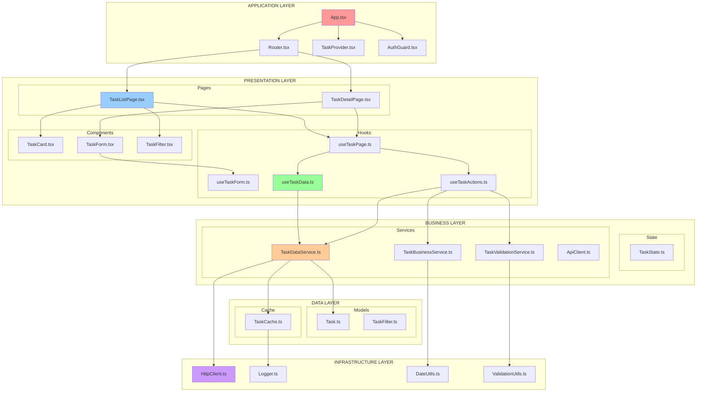

# Complete Guide to 5-Layer Architecture with Separation of Concerns

## Table of Contents

1. [Architecture Overview](#architecture-overview)
2. [Layer Definitions & Rules](#layer-definitions--rules)
3. [Separation of Concerns Principles](#separation-of-concerns-principles)
4. [Simple Example Project](#simple-example-project)
5. [Data Flow Patterns](#data-flow-patterns)
6. [Best Practices & Rules](#best-practices--rules)
7. [Common Anti-Patterns](#common-anti-patterns)

---

## Architecture Overview

The 5-Layer Architecture with Separation of Concerns is a structural pattern that organizes code into distinct layers, each with specific responsibilities. This ensures maintainable, testable, and scalable applications.

### Layer Flow Direction

```
Application Layer ↓
Presentation Layer ↓
Business Layer ↓
Data Layer ↓
Infrastructure Layer
```

**Key Principle**: Dependencies only flow downward. Upper layers can depend on lower layers, but never the reverse.

---

## 🏗️ Alternative Architecture: Feature-Sliced Design

Feature-Sliced Design (FSD) is a modern frontend architecture that organizes code by features and business domains, rather than by technical layers. This approach is especially effective for large-scale applications with many independent features.

### 🔹 Key Concepts

- **Slices**: The main organizational unit, representing a business domain or feature (e.g., `accounts`, `empires`, `treaties`).
- **Layers within Slices**: Each slice contains its own `ui`, `model`, `api`, and `lib` folders, encapsulating all logic, data, and UI for that feature.
- **Shared Layer**: Contains cross-cutting utilities, design system components, and shared types used by multiple slices.

### 🔹 Example Structure

```
src/
├── app/                # Application setup, providers, routing
├── shared/             # Shared UI, utils, types, constants
│   ├── ui/
│   ├── lib/
│   ├── config/
│   └── types/
├── features/           # Feature slices
│   ├── accounts/
│   │   ├── ui/
│   │   ├── model/
│   │   ├── api/
│   │   └── lib/
│   ├── empires/
│   │   ├── ui/
│   │   ├── model/
│   │   ├── api/
│   │   └── lib/
│   └── treaties/
│       ├── ui/
│       ├── model/
│       ├── api/
│       └── lib/
└── pages/              # Route-level pages, composed from features
```

### 🔹 Principles

- **Feature Encapsulation**: All logic, data, and UI for a feature live together, reducing cross-feature dependencies.
- **Explicit Public API**: Each slice exposes only what is needed for other slices or the app to use.
- **Scalability**: New features are added as new slices, minimizing impact on existing code.
- **Separation of Concerns**: Technical concerns (UI, model, API) are separated within each feature, not globally.

### 🔹 When to Use

- Large or rapidly growing projects with many independent features
- Teams working in parallel on different business domains
- Projects where feature isolation and scalability are priorities

### 🔹 Comparison to 5-Layer Architecture

- 5-Layer: Organizes by technical responsibility (presentation, business, data, etc.)
- FSD: Organizes by business feature/domain, with technical layers inside each feature
- Both approaches enforce separation of concerns, but FSD optimizes for feature scalability and parallel development

---

---

## Architectural Building Blocks Explained

To help clarify the terminology used throughout this guide, here are concise definitions of common building blocks found in a 5-layer architecture:

- **Hooks**: Reusable logic units (often for state, side effects, or data fetching) that can be shared across components or layers. In React, these are custom hooks (e.g., `useAccountData`).
- **Controllers**: Orchestrators that coordinate business logic, workflows, or data flow. In modern architectures, controllers should not contain UI logic and are often plain TypeScript classes or functions.
- **Services**: Encapsulate business or data logic, such as validation, calculations, or API communication. Services are stateless and reusable.
- **Clients**: Abstractions for communicating with external APIs or backend services. Clients handle HTTP requests, authentication, and error handling at the network boundary.
- **Models**: TypeScript interfaces or classes that define the structure and shape of domain data (e.g., `Account`, `Empire`). Models are used for type safety and data validation.
- **Validators**: Functions or classes that check data against business or schema rules, ensuring correctness before processing or storage.
- **Constants**: Immutable values used throughout the application, such as configuration, error codes, or UI strings. Centralized for consistency.
- **Types**: TypeScript interfaces, types, or enums that define the shape of data, props, or contracts between layers.
- **Forms**: UI elements and logic for user input, validation, and submission. Usually implemented as components or hooks in the presentation layer.
- **Layout**: Components or files that define the structural arrangement of pages or sections (e.g., navigation, headers, footers, sidebars).
- **Pages**: Top-level presentation components mapped to routes. Pages compose other components and hooks to render a complete view.
- **Routes/Router**: Definitions and logic for mapping URLs to pages or components. The router handles navigation, route guards, and sometimes lazy loading.
- **Styles**: CSS, SCSS, or CSS-in-JS files that define the visual appearance of components and pages.
- **Components**: Reusable UI building blocks, such as buttons, cards, lists, or dialogs. Components are focused on rendering and user interaction, not business logic.

---

---

## Layer Definitions & Rules

### 1. 🚀 **Application Layer**

**Purpose**: Application-wide configuration, routing, and global state management.

#### 📋 **Responsibilities**

- Application bootstrapping and initialization
- Global providers and context setup
- Route configuration and navigation
- Authentication guards and permissions
- Error boundaries and global error handling

#### ✅ **Allowed Dependencies**

- ✅ Presentation Layer (pages, layouts)
- ✅ Business Layer (controllers, services)
- ✅ Data Layer (models, API clients)
- ✅ Infrastructure Layer (configuration, constants)
- ✅ External libraries (React Router, etc.)

#### ❌ **Forbidden Dependencies**

- ❌ None (except for circular dependencies or upward dependencies)

#### 📁 **File Structure**

```
src/application/
├── App.tsx                 # Main app component
├── Router.tsx              # Route definitions
├── providers/              # Context providers
│   ├── AuthProvider.tsx
│   ├── ThemeProvider.tsx
│   └── ErrorProvider.tsx
├── guards/                 # Route guards
│   ├── AuthGuard.tsx
│   └── PermissionGuard.tsx
└── layout/                 # App-level layouts
    └── AppLayout.tsx
```

#### 🎯 **Rules**

1. ✅ **DO** handle global application concerns
2. ✅ **DO** provide application-wide context
3. ✅ **DO** configure routing and navigation
4. ❌ **DON'T** contain business logic
5. ❌ **DON'T** directly manipulate data
6. ❌ **DON'T** perform API calls

---

### 2. 🎨 **Presentation Layer**

**Purpose**: User interface components, pages, and user interaction handling.

#### 📋 **Responsibilities**

- UI component rendering and styling
- User input handling and form management
- Page-level component composition
- Local UI state management (modals, tabs, etc.)
- Visual feedback (loading states, animations)

#### ✅ **Allowed Dependencies**

- ✅ Business Layer (hooks, controllers)
- ✅ Data Layer (services, models, API clients)
- ✅ Infrastructure Layer (types, constants)
- ✅ Other Presentation components

#### ❌ **Forbidden Dependencies**

- ❌ Application Layer
- ❌ Any upward dependency (no circular or reverse dependencies)

#### 📁 **File Structure**

```
src/presentation/
├── pages/                  # Route-level components
│   ├── HomePage.tsx
│   ├── UserPage.tsx
│   └── SettingsPage.tsx
├── components/             # Reusable UI components
│   ├── common/
│   ├── forms/
│   └── layout/
├── hooks/                  # Presentation-specific hooks
│   ├── useUserPage.ts
│   └── useFormState.ts
└── styles/                 # Styling files
    ├── globals.css
    └── components.css
```

#### 🎯 **Rules**

1. ✅ **DO** focus purely on UI rendering
2. ✅ **DO** handle user interactions
3. ✅ **DO** manage local UI state
4. ✅ **DO** use presentation hooks to access business logic
5. ❌ **DON'T** contain business logic
6. ❌ **DON'T** make direct API calls
7. ❌ **DON'T** perform data validation
8. ❌ **DON'T** directly import business controllers

---

### 3. 🧠 **Business Layer**

**Purpose**: Application business logic, rules, and workflow orchestration.

#### 📋 **Responsibilities**

- Business rule implementation
- Workflow orchestration and coordination
- Data validation and transformation
- Permission and authorization logic
- State management for business entities

#### ✅ **Allowed Dependencies**

- ✅ Data Layer (services, models, cache)
- ✅ Infrastructure Layer (types, utilities)

#### ❌ **Forbidden Dependencies**

- ❌ Application Layer
- ❌ Presentation Layer (components, pages)
- ❌ Any upward dependency (no circular or reverse dependencies)

#### 📁 **File Structure**

```
src/business/
├── hooks/                  # Business logic hooks
│   ├── data/              # Data management hooks
│   ├── business/          # Business operation hooks
│   └── infrastructure/    # Cross-cutting hooks
├── controllers/           # Business orchestration (legacy)
│   ├── UserController.tsx
│   └── OrderController.tsx
├── services/              # Business rule implementation
│   ├── UserService.ts
│   ├── ValidationService.ts
│   └── PermissionService.ts
├── state/                 # Business state management
│   ├── UserState.ts
│   └── AppState.ts
└── utils/                 # Business utilities
    ├── calculations.ts
    └── transformations.ts
```

#### 🎯 **Rules**

1. ✅ **DO** implement business rules and logic
2. ✅ **DO** coordinate data operations
3. ✅ **DO** validate business constraints
4. ✅ **DO** manage business entity state
5. ❌ **DON'T** contain UI logic
6. ❌ **DON'T** handle user interactions directly
7. ❌ **DON'T** manage presentation state
8. ❌ **DON'T** import presentation components

---

### 4. 🗄️ **Data Layer**

**Purpose**: Data access, storage, and external service communication.

#### 📋 **Responsibilities**

- API communication and HTTP requests
- Data caching and synchronization
- Data model definitions and typing
- Data transformation and serialization
- External service integration

#### ✅ **Allowed Dependencies**

- Now, com✅ Infrastructure Layer (configuration, HTTP client)
- ✅ External APIs and services

#### ❌ **Forbidden Dependencies**

- ❌ Application Layer
- ❌ Presentation Layer
- ❌ Business Layer
- ❌ Any upward dependency (no circular or reverse dependencies)

#### 📁 **File Structure**

```
src/data/
├── services/              # Data access services
│   ├── UserDataService.ts
│   ├── OrderDataService.ts
│   └── ApiClient.ts
├── models/                # Data model definitions
│   ├── User.ts
│   ├── Order.ts
│   └── ApiResponse.ts
├── cache/                 # Caching layer
│   ├── EntityCache.ts
│   ├── CacheManager.ts
│   └── CacheStrategies.ts
├── types/                 # Data-specific types
│   ├── UserTypes.ts
│   └── ApiTypes.ts
└── validators/            # Data validation
    ├── UserValidator.ts
    └── SchemaValidator.ts
```

#### 🎯 **Rules**

1. ✅ **DO** handle all external data communication
2. ✅ **DO** implement caching strategies
3. ✅ **DO** define data models and types
4. ✅ **DO** transform data between formats
5. ❌ **DON'T** contain business logic
6. ❌ **DON'T** handle user interactions
7. ❌ **DON'T** manage application state
8. ❌ **DON'T** import from higher layers

---

### 5. 🔧 **Infrastructure Layer**

**Purpose**: Cross-cutting concerns, utilities, and foundational services.

#### 📋 **Responsibilities**

- Configuration management
- Logging and monitoring
- Error handling utilities
- Common utility functions
- Type definitions and constants

#### ✅ **Allowed Dependencies**

- ✅ External libraries and utilities
- ✅ Environment variables
- ✅ System resources

#### ❌ **Forbidden Dependencies**

- ❌ Application Layer
- ❌ Presentation Layer
- ❌ Business Layer
- ❌ Data Layer
- ❌ Any upward dependency (no circular or reverse dependencies)

#### 📁 **File Structure**

```
src/infrastructure/
├── config/                # Configuration
│   ├── environment.ts
│   ├── api.config.ts
│   └── app.config.ts
├── utils/                 # Utility functions
│   ├── dateUtils.ts
│   ├── stringUtils.ts
│   └── arrayUtils.ts
├── types/                 # Common types
│   ├── common.types.ts
│   └── utility.types.ts
├── constants/             # Application constants
│   ├── api.constants.ts
│   └── app.constants.ts
├── errors/                # Error handling
│   ├── AppError.ts
│   ├── ErrorHandler.ts
│   └── ErrorTypes.ts
└── logger/                # Logging utilities
    ├── Logger.ts
    └── LoggerConfig.ts
```

#### 🎯 **Rules**

1. ✅ **DO** provide foundational utilities
2. ✅ **DO** handle cross-cutting concerns
3. ✅ **DO** manage configuration
4. ✅ **DO** implement logging and monitoring
5. ❌ **DON'T** contain domain-specific logic
6. ❌ **DON'T** reference application layers
7. ❌ **DON'T** handle user interactions
8. ❌ **DON'T** manage business state

---

## Separation of Concerns Principles

### 1. **Single Responsibility Principle (SRP)**

Each layer and module should have one reason to change.

```typescript
// ✅ GOOD: Each service has one responsibility
class UserValidationService {
    validateEmail(email: string): boolean { }
    validatePassword(password: string): boolean { }
}

class UserDataService {
    fetchUser(id: string): Promise<User> { }
    saveUser(user: User): Promise<void> { }
}

// ❌ BAD: Mixed responsibilities
class UserService {
    validateEmail(email: string): boolean { }  // Validation
    fetchUser(id: string): Promise<User> { }   // Data access
    renderUserCard(user: User): JSX.Element { } // Presentation
}
```

### 2. **Dependency Inversion Principle (DIP)**

High-level modules should not depend on low-level modules. Both should depend on abstractions.

```typescript
// ✅ GOOD: Depends on abstraction
interface IUserRepository {
    findById(id: string): Promise<User>;
}

class UserService {
    constructor(private userRepo: IUserRepository) {}
    
    async getUser(id: string): Promise<User> {
        return this.userRepo.findById(id);
    }
}

// ❌ BAD: Direct dependency on concrete implementation
class UserService {
    private apiClient = new HttpClient(); // Direct dependency
    
    async getUser(id: string): Promise<User> {
        return this.apiClient.get(`/users/${id}`);
    }
}
```

### 3. **Interface Segregation Principle (ISP)**

Clients should not be forced to depend on interfaces they don't use.

```typescript
// ✅ GOOD: Specific interfaces
interface IUserReader {
    findById(id: string): Promise<User>;
    findByEmail(email: string): Promise<User>;
}

interface IUserWriter {
    save(user: User): Promise<void>;
    delete(id: string): Promise<void>;
}

// ❌ BAD: Fat interface
interface IUserRepository {
    findById(id: string): Promise<User>;
    findByEmail(email: string): Promise<User>;
    save(user: User): Promise<void>;
    delete(id: string): Promise<void>;
    generateReport(): Promise<Report>; // Not needed by all clients
    sendNotification(user: User): Promise<void>; // Not needed by all clients
}
```

---

## Simple Example Project: Task Manager

Let's build a simple task manager to demonstrate the 5-layer architecture:

### 📋 Project Requirements

- Users can create, read, update, and delete tasks
- Tasks have title, description, status, and due date
- Users can filter tasks by status
- Tasks are persisted to a backend API

### 🏛️ Architecture Flowchart



### 📁 Project Structure

```
src/
├── application/            # Application Layer
│   ├── App.tsx
│   ├── Router.tsx
│   └── providers/
│       └── TaskProvider.tsx
├── presentation/           # Presentation Layer
│   ├── pages/
│   │   ├── TaskListPage.tsx
│   │   └── TaskDetailPage.tsx
│   ├── components/
│   │   ├── TaskCard.tsx
│   │   ├── TaskForm.tsx
│   │   └── TaskFilter.tsx
│   └── hooks/
│       ├── useTaskPage.ts
│       └── useTaskForm.ts
├── business/              # Business Layer
│   ├── hooks/
│   │   ├── useTaskData.ts
│   │   └── useTaskActions.ts
│   ├── services/
│   │   ├── TaskValidationService.ts
│   │   └── TaskBusinessService.ts
│   └── state/
│       └── TaskState.ts
├── data/                  # Data Layer
│   ├── services/
│   │   ├── TaskDataService.ts
│   │   └── ApiClient.ts
│   ├── models/
│   │   ├── Task.ts
│   │   └── TaskFilter.ts
│   └── cache/
│       └── TaskCache.ts
└── infrastructure/        # Infrastructure Layer
    ├── utils/
    │   ├── HttpClient.ts
    │   ├── DateUtils.ts
    │   └── ValidationUtils.ts
    ├── constants/
    │   └── ApiConstants.ts
    └── types/
        └── CommonTypes.ts
```

### 🔍 Implementation Examples

#### **1. Application Layer**

```typescript
// application/App.tsx
import { TaskProvider } from './providers/TaskProvider';
import { Router } from './Router';

export function App() {
    return (
        <TaskProvider>
            <Router />
        </TaskProvider>
    );
}

// application/Router.tsx
import { BrowserRouter, Routes, Route } from 'react-router-dom';
import { TaskListPage } from '../presentation/pages/TaskListPage';
import { TaskDetailPage } from '../presentation/pages/TaskDetailPage';

export function Router() {
    return (
        <BrowserRouter>
            <Routes>
                <Route path="/tasks" element={<TaskListPage />} />
                <Route path="/tasks/:id" element={<TaskDetailPage />} />
            </Routes>
        </BrowserRouter>
    );
}
```

#### **2. Presentation Layer**

```typescript
// presentation/pages/TaskListPage.tsx
import { useTaskPage } from '../hooks/useTaskPage';
import { TaskCard } from '../components/TaskCard';
import { TaskFilter } from '../components/TaskFilter';

export function TaskListPage() {
    const {
        tasks,
        loading,
        error,
        filter,
        handleFilterChange,
        handleTaskUpdate,
        handleTaskDelete
    } = useTaskPage();

    return (
        <div className="task-list-page">
            <h1>Tasks</h1>
            <TaskFilter filter={filter} onChange={handleFilterChange} />
            
            {loading && <div>Loading...</div>}
            {error && <div>Error: {error}</div>}
            
            <div className="task-grid">
                {tasks.map(task => (
                    <TaskCard
                        key={task.id}
                        task={task}
                        onUpdate={handleTaskUpdate}
                        onDelete={handleTaskDelete}
                    />
                ))}
            </div>
        </div>
    );
}

// presentation/components/TaskCard.tsx
import { Task } from '../../data/models/Task';

interface TaskCardProps {
    task: Task;
    onUpdate: (task: Task) => void;
    onDelete: (id: string) => void;
}

export function TaskCard({ task, onUpdate, onDelete }: TaskCardProps) {
    return (
        <div className="task-card">
            <h3>{task.title}</h3>
            <p>{task.description}</p>
            <span className={`status ${task.status}`}>{task.status}</span>
            <div className="actions">
                <button onClick={() => onUpdate(task)}>Edit</button>
                <button onClick={() => onDelete(task.id)}>Delete</button>
            </div>
        </div>
    );
}

// presentation/hooks/useTaskPage.ts
import { useState } from 'react';
import { useTaskData } from '../../business/hooks/useTaskData';
import { useTaskActions } from '../../business/hooks/useTaskActions';

export function useTaskPage() {
    const [filter, setFilter] = useState('all');
    
    const { tasks, loading, error } = useTaskData(filter);
    const { updateTask, deleteTask } = useTaskActions();

    const handleFilterChange = (newFilter: string) => {
        setFilter(newFilter);
    };

    const handleTaskUpdate = (task: Task) => {
        updateTask(task);
    };

    const handleTaskDelete = (id: string) => {
        deleteTask(id);
    };

    return {
        tasks,
        loading,
        error,
        filter,
        handleFilterChange,
        handleTaskUpdate,
        handleTaskDelete
    };
}
```

#### **3. Business Layer**

```typescript
// business/hooks/useTaskData.ts
import { useState, useEffect } from 'react';
import { TaskDataService } from '../../data/services/TaskDataService';
import { Task } from '../../data/models/Task';

export function useTaskData(filter: string) {
    const [tasks, setTasks] = useState<Task[]>([]);
    const [loading, setLoading] = useState(false);
    const [error, setError] = useState<string | null>(null);

    useEffect(() => {
        const fetchTasks = async () => {
            setLoading(true);
            setError(null);
            
            try {
                const fetchedTasks = await TaskDataService.getTasks(filter);
                setTasks(fetchedTasks);
            } catch (err) {
                setError(err instanceof Error ? err.message : 'Failed to fetch tasks');
            } finally {
                setLoading(false);
            }
        };

        fetchTasks();
    }, [filter]);

    return { tasks, loading, error };
}

// business/hooks/useTaskActions.ts
import { TaskDataService } from '../../data/services/TaskDataService';
import { TaskValidationService } from '../services/TaskValidationService';
import { Task } from '../../data/models/Task';

export function useTaskActions() {
    const updateTask = async (task: Task) => {
        const validation = TaskValidationService.validateTask(task);
        if (!validation.isValid) {
            throw new Error(validation.error);
        }
        
        await TaskDataService.updateTask(task);
    };

    const deleteTask = async (id: string) => {
        await TaskDataService.deleteTask(id);
    };

    const createTask = async (taskData: Partial<Task>) => {
        const validation = TaskValidationService.validateTaskData(taskData);
        if (!validation.isValid) {
            throw new Error(validation.error);
        }
        
        await TaskDataService.createTask(taskData);
    };

    return { updateTask, deleteTask, createTask };
}

// business/services/TaskValidationService.ts
import { Task } from '../../data/models/Task';
import { ValidationUtils } from '../../infrastructure/utils/ValidationUtils';

export class TaskValidationService {
    static validateTask(task: Task) {
        if (!task.title || task.title.trim().length === 0) {
            return { isValid: false, error: 'Task title is required' };
        }
        
        if (task.title.length > 100) {
            return { isValid: false, error: 'Task title must be less than 100 characters' };
        }
        
        if (!ValidationUtils.isValidDate(task.dueDate)) {
            return { isValid: false, error: 'Invalid due date' };
        }
        
        return { isValid: true };
    }

    static validateTaskData(data: Partial<Task>) {
        if (!data.title) {
            return { isValid: false, error: 'Title is required' };
        }
        
        return { isValid: true };
    }
}
```

#### **4. Data Layer**

```typescript
// data/models/Task.ts
export interface Task {
    id: string;
    title: string;
    description: string;
    status: 'pending' | 'in-progress' | 'completed';
    dueDate: Date;
    createdAt: Date;
    updatedAt: Date;
}

export interface CreateTaskRequest {
    title: string;
    description: string;
    dueDate: Date;
}

export interface UpdateTaskRequest {
    title?: string;
    description?: string;
    status?: Task['status'];
    dueDate?: Date;
}

// data/services/TaskDataService.ts
import { Task, CreateTaskRequest, UpdateTaskRequest } from '../models/Task';
import { ApiClient } from './ApiClient';
import { TaskCache } from '../cache/TaskCache';

export class TaskDataService {
    static async getTasks(filter: string = 'all'): Promise<Task[]> {
        const cacheKey = `tasks_${filter}`;
        const cached = TaskCache.get(cacheKey);
        
        if (cached) {
            return cached;
        }
        
        const response = await ApiClient.get<Task[]>(`/tasks?filter=${filter}`);
        TaskCache.set(cacheKey, response.data);
        
        return response.data;
    }

    static async getTask(id: string): Promise<Task> {
        const cacheKey = `task_${id}`;
        const cached = TaskCache.get(cacheKey);
        
        if (cached) {
            return cached;
        }
        
        const response = await ApiClient.get<Task>(`/tasks/${id}`);
        TaskCache.set(cacheKey, response.data);
        
        return response.data;
    }

    static async createTask(data: CreateTaskRequest): Promise<Task> {
        const response = await ApiClient.post<Task>('/tasks', data);
        TaskCache.invalidatePattern('tasks_');
        
        return response.data;
    }

    static async updateTask(task: Task): Promise<Task> {
        const response = await ApiClient.put<Task>(`/tasks/${task.id}`, task);
        TaskCache.invalidatePattern('tasks_');
        TaskCache.set(`task_${task.id}`, response.data);
        
        return response.data;
    }

    static async deleteTask(id: string): Promise<void> {
        await ApiClient.delete(`/tasks/${id}`);
        TaskCache.invalidatePattern('tasks_');
        TaskCache.delete(`task_${id}`);
    }
}

// data/cache/TaskCache.ts
import { Logger } from '../../infrastructure/utils/Logger';

interface CacheItem<T> {
    data: T;
    timestamp: number;
    ttl: number;
}

export class TaskCache {
    private static cache = new Map<string, CacheItem<any>>();
    private static readonly DEFAULT_TTL = 5 * 60 * 1000; // 5 minutes

    static get<T>(key: string): T | null {
        const item = this.cache.get(key);
        
        if (!item) {
            return null;
        }
        
        if (Date.now() - item.timestamp > item.ttl) {
            this.cache.delete(key);
            Logger.info(`Cache expired for key: ${key}`);
            return null;
        }
        
        Logger.info(`Cache hit for key: ${key}`);
        return item.data;
    }

    static set<T>(key: string, data: T, ttl: number = this.DEFAULT_TTL): void {
        this.cache.set(key, {
            data,
            timestamp: Date.now(),
            ttl
        });
        Logger.info(`Cache set for key: ${key}`);
    }

    static delete(key: string): void {
        this.cache.delete(key);
        Logger.info(`Cache deleted for key: ${key}`);
    }

    static invalidatePattern(pattern: string): void {
        const keysToDelete = Array.from(this.cache.keys()).filter(key => 
            key.includes(pattern)
        );
        
        keysToDelete.forEach(key => this.cache.delete(key));
        Logger.info(`Cache invalidated for pattern: ${pattern}, deleted ${keysToDelete.length} items`);
    }

    static clear(): void {
        this.cache.clear();
        Logger.info('Cache cleared');
    }
}
```

#### **5. Infrastructure Layer**

```typescript
// infrastructure/utils/HttpClient.ts
import { Logger } from './Logger';

export interface ApiResponse<T> {
    data: T;
    status: number;
    message?: string;
}

export class HttpClient {
    private baseURL: string;

    constructor(baseURL: string) {
        this.baseURL = baseURL;
    }

    async get<T>(endpoint: string): Promise<ApiResponse<T>> {
        return this.request<T>('GET', endpoint);
    }

    async post<T>(endpoint: string, data?: any): Promise<ApiResponse<T>> {
        return this.request<T>('POST', endpoint, data);
    }

    async put<T>(endpoint: string, data?: any): Promise<ApiResponse<T>> {
        return this.request<T>('PUT', endpoint, data);
    }

    async delete<T>(endpoint: string): Promise<ApiResponse<T>> {
        return this.request<T>('DELETE', endpoint);
    }

    private async request<T>(
        method: string,
        endpoint: string,
        data?: any
    ): Promise<ApiResponse<T>> {
        const url = `${this.baseURL}${endpoint}`;
        
        Logger.info(`${method} ${url}`);
        
        try {
            const response = await fetch(url, {
                method,
                headers: {
                    'Content-Type': 'application/json',
                },
                body: data ? JSON.stringify(data) : undefined,
            });

            if (!response.ok) {
                throw new Error(`HTTP ${response.status}: ${response.statusText}`);
            }

            const responseData = await response.json();
            
            return {
                data: responseData,
                status: response.status,
            };
        } catch (error) {
            Logger.error(`Request failed: ${method} ${url}`, error);
            throw error;
        }
    }
}

// infrastructure/utils/ValidationUtils.ts
export class ValidationUtils {
    static isValidEmail(email: string): boolean {
        const emailRegex = /^[^\s@]+@[^\s@]+\.[^\s@]+$/;
        return emailRegex.test(email);
    }

    static isValidDate(date: any): boolean {
        return date instanceof Date && !isNaN(date.getTime());
    }

    static isValidString(value: any, minLength: number = 1): boolean {
        return typeof value === 'string' && value.trim().length >= minLength;
    }

    static isValidNumber(value: any, min?: number, max?: number): boolean {
        if (typeof value !== 'number' || isNaN(value)) {
            return false;
        }
        
        if (min !== undefined && value < min) {
            return false;
        }
        
        if (max !== undefined && value > max) {
            return false;
        }
        
        return true;
    }
}

// infrastructure/utils/DateUtils.ts
export class DateUtils {
    static formatDate(date: Date, format: string = 'YYYY-MM-DD'): string {
        const year = date.getFullYear();
        const month = String(date.getMonth() + 1).padStart(2, '0');
        const day = String(date.getDate()).padStart(2, '0');
        
        return format
            .replace('YYYY', String(year))
            .replace('MM', month)
            .replace('DD', day);
    }

    static isOverdue(date: Date): boolean {
        return date < new Date();
    }

    static daysBetween(date1: Date, date2: Date): number {
        const oneDay = 24 * 60 * 60 * 1000;
        return Math.round((date2.getTime() - date1.getTime()) / oneDay);
    }

    static addDays(date: Date, days: number): Date {
        const result = new Date(date);
        result.setDate(result.getDate() + days);
        return result;
    }
}

// infrastructure/utils/Logger.ts
export enum LogLevel {
    DEBUG = 0,
    INFO = 1,
    WARN = 2,
    ERROR = 3
}

export class Logger {
    private static logLevel: LogLevel = LogLevel.INFO;

    static setLogLevel(level: LogLevel): void {
        this.logLevel = level;
    }

    static debug(message: string, ...args: any[]): void {
        if (this.logLevel <= LogLevel.DEBUG) {
            console.debug(`[DEBUG] ${message}`, ...args);
        }
    }

    static info(message: string, ...args: any[]): void {
        if (this.logLevel <= LogLevel.INFO) {
            console.info(`[INFO] ${message}`, ...args);
        }
    }

    static warn(message: string, ...args: any[]): void {
        if (this.logLevel <= LogLevel.WARN) {
            console.warn(`[WARN] ${message}`, ...args);
        }
    }

    static error(message: string, ...args: any[]): void {
        if (this.logLevel <= LogLevel.ERROR) {
            console.error(`[ERROR] ${message}`, ...args);
        }
    }
}
```

---

## Data Flow Patterns

### 1. **Read Operation Flow**

```
User Interaction (Presentation) 
→ Presentation Hook 
→ Business Hook 
→ Data Service 
→ Cache Check 
→ API Call (if needed) 
→ Data Transformation 
→ Cache Update 
→ Business Logic Application 
→ UI Update
```

### 2. **Write Operation Flow**

```
User Input (Presentation) 
→ Presentation Hook 
→ Business Hook 
→ Business Validation 
→ Data Service 
→ API Call 
→ Cache Invalidation 
→ Success/Error Handling 
→ UI Update
```

### 3. **Error Handling Flow**

```
Error (Any Layer) 
→ Error Logging (Infrastructure) 
→ Error Transformation (Data/Business) 
→ User-Friendly Message (Presentation) 
→ UI Error Display
```

---

## Best Practices & Rules

###  **General Rules**

#### **Dependency Rules**

1. ✅ **DO** follow the dependency rule (dependencies flow downward only)
2. ✅ **DO** use dependency injection for loose coupling
3. ❌ **DON'T** import from higher layers
4. ❌ **DON'T** create circular dependencies

#### **Code Organization Rules**

1. ✅ **DO** group related functionality together
2. ✅ **DO** use consistent naming conventions
3. ✅ **DO** keep files small and focused
4. ❌ **DON'T** mix concerns in a single file

#### **Testing Rules**

1. ✅ **DO** write unit tests for each layer
2. ✅ **DO** mock dependencies from lower layers
3. ✅ **DO** test business logic separately from UI
4. ❌ **DON'T** test implementation details

### **Layer-Specific Rules**

#### **Application Layer Rules**

1. ✅ **DO** keep App.tsx minimal and focused on setup
2. ✅ **DO** handle global concerns (auth, routing, providers)
3. ❌ **DON'T** include business logic in route components
4. ❌ **DON'T** directly manipulate data in this layer

#### **Presentation Layer Rules**

1. ✅ **DO** focus solely on UI rendering and user interaction
2. ✅ **DO** use presentation hooks to access business logic
3. ✅ **DO** keep components pure and predictable
4. ❌ **DON'T** perform API calls directly in components
5. ❌ **DON'T** include business validation in components
6. ❌ **DON'T** directly import business controllers

#### **Business Layer Rules**

1. ✅ **DO** implement all business rules and validations
2. ✅ **DO** coordinate operations between data services
3. ✅ **DO** handle business-specific error cases
4. ❌ **DON'T** contain UI-specific logic
5. ❌ **DON'T** directly manipulate DOM or presentation state

#### **Data Layer Rules**

1. ✅ **DO** handle all external data communication
2. ✅ **DO** implement caching strategies
3. ✅ **DO** transform data between formats
4. ❌ **DON'T** include business logic
5. ❌ **DON'T** handle user interface concerns

#### **Infrastructure Layer Rules**

1. ✅ **DO** provide reusable utility functions
2. ✅ **DO** handle cross-cutting concerns
3. ✅ **DO** remain framework/domain agnostic
4. ❌ **DON'T** reference application-specific concepts
5. ❌ **DON'T** contain business rules

---

## ⚠️ Common Anti-Patterns

### 1. **Layer Violations**

```typescript
// ❌ BAD: Presentation directly calling data layer
import { TaskDataService } from '../../data/services/TaskDataService';

function TaskList() {
    const [tasks, setTasks] = useState([]);
    
    useEffect(() => {
        TaskDataService.getTasks().then(setTasks); // WRONG!
    }, []);
    
    return <div>{/* ... */}</div>;
}

// ✅ GOOD: Using proper layer separation
import { useTaskData } from '../../business/hooks/useTaskData';

function TaskList() {
    const { tasks, loading, error } = useTaskData(); // Correct!
    
    return <div>{/* ... */}</div>;
}
```

### 2. **Mixed Responsibilities**

```typescript
// ❌ BAD: Component handling business logic
function TaskForm({ onSave }) {
    const [task, setTask] = useState({});
    
    const handleSubmit = async () => {
        // Business logic in component - WRONG!
        if (!task.title || task.title.length < 3) {
            alert('Title must be at least 3 characters');
            return;
        }
        
        if (new Date(task.dueDate) < new Date()) {
            alert('Due date cannot be in the past');
            return;
        }
        
        await fetch('/api/tasks', {
            method: 'POST',
            body: JSON.stringify(task)
        });
    };
    
    return <form onSubmit={handleSubmit}>{/* ... */}</form>;
}

// ✅ GOOD: Separated concerns
function TaskForm({ onSave }) {
    const { task, errors, handleChange, handleSubmit } = useTaskForm(onSave);
    
    return (
        <form onSubmit={handleSubmit}>
            {/* Pure presentation */}
        </form>
    );
}
```

### 3. **Circular Dependencies**

```typescript
// ❌ BAD: Circular dependency
// UserService imports OrderService
// OrderService imports UserService

// ✅ GOOD: Shared dependencies moved to lower layer
// Both services use shared utilities from infrastructure layer
```

### 4. **Fat Interfaces**

```typescript
// ❌ BAD: Fat interface
interface ITaskService {
    createTask(task: Task): Promise<void>;
    updateTask(task: Task): Promise<void>;
    deleteTask(id: string): Promise<void>;
    validateTask(task: Task): boolean;
    formatTaskTitle(title: string): string;
    sendNotification(task: Task): Promise<void>;
    generateReport(): Promise<Report>;
}

// ✅ GOOD: Segregated interfaces
interface ITaskRepository {
    create(task: Task): Promise<void>;
    update(task: Task): Promise<void>;
    delete(id: string): Promise<void>;
}

interface ITaskValidator {
    validate(task: Task): ValidationResult;
}

interface ITaskFormatter {
    formatTitle(title: string): string;
}
```

### 5. **Leaky Abstractions**

```typescript
// ❌ BAD: Data layer details leaking to business layer
class TaskService {
    async getTasks() {
        // HTTP status codes in business layer - WRONG!
        try {
            const response = await fetch('/api/tasks');
            if (response.status === 404) {
                return [];
            }
            if (response.status === 401) {
                throw new Error('Unauthorized');
            }
            return response.json();
        } catch (error) {
            throw error;
        }
    }
}

// ✅ GOOD: Proper abstraction
class TaskDataService {
    async getTasks(): Promise<Task[]> {
        try {
            const response = await this.httpClient.get<Task[]>('/tasks');
            return response.data;
        } catch (error) {
            // Transform HTTP errors to domain errors
            throw new TaskDataError('Failed to fetch tasks');
        }
    }
}

class TaskService {
    async getTasks(): Promise<Task[]> {
        try {
            return await TaskDataService.getTasks();
        } catch (error) {
            // Handle domain errors only
            throw new TaskBusinessError('Unable to load tasks');
        }
    }
}
```

---

## Summary

The 5-Layer Architecture with Separation of Concerns provides:

### ✅ **Benefits**

- **Maintainability**: Easy to locate and modify specific functionality
- **Testability**: Each layer can be tested in isolation
- **Scalability**: New features can be added without affecting existing code
- **Reusability**: Business logic and utilities can be shared across features
- **Team Collaboration**: Different team members can work on different layers
- **Code Quality**: Clear separation prevents mixing of concerns

### 🎯 **Key Takeaways**

1. **Follow the dependency rule**: Dependencies only flow downward
2. **Single responsibility**: Each layer and module should have one clear purpose
3. **Interface-based design**: Depend on abstractions, not implementations
4. **Consistent patterns**: Use the same patterns across your application
5. **Progressive disclosure**: Start simple and add complexity as needed

This architecture pattern helps create robust, maintainable applications that can scale with your project's needs while maintaining code quality and developer productivity.